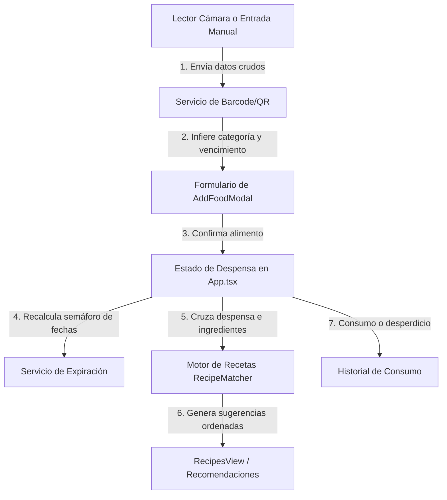

# COCINACERO
*Una guía técnica profunda sobre el diseño, algoritmos y despliegue del inventario inteligente*

---

## Ficha Técnica del Proyecto
*   **Nombre Oficial**: CocinaCero
*   **Versión**: 1.0.0
*   **Licencia**: MIT
*   **Tecnologías Principales**: React 18, Ionic React, Capacitor 6, TypeScript, Vite, HTML5-QRCode, Vitest.

---

## Tabla de Contenidos
1. **Introducción y Filosofía Zero-Waste**
2. **Flujo de Datos y Arquitectura de Componentes**
3. **Manual Técnico de Archivos del Sistema**
4. **Explicación Matemática y Lógica de Algoritmos**
5. **Guía Práctica de Integración de Códigos QR/Barras**
6. **Compilación y Depuración en Dispositivos Android**
7. **Plan de Escalabilidad y Futuras Mejoras**

---

## 1. Introducción y Filosofía Zero-Waste

El desperdicio de alimentos es uno de los mayores desafíos económicos y ecológicos en los hogares modernos. Frecuentemente, los alimentos se dañan porque se olvidan en el fondo de la alacena o el refrigerador, o porque los usuarios no saben qué cocinar con los ingredientes que tienen disponibles antes de que estos expiren.

**CocinaCero** aborda este problema atacando tres pilares simultáneamente:
1.  **Visibilidad**: Saber exactamente qué hay en la cocina, ordenado de menor a mayor cantidad de días de vida útil restante.
2.  **Facilidad de captura**: Agilizar la carga mediante el escaneo de códigos de barra comerciales o códigos QR que autocompletan todo el formulario en un solo paso.
3.  **Algoritmo de recomendación con incentivos (Zero-Waste Score)**: Las recetas sugeridas no se ordenan por orden alfabético ni por dificultad; se ordenan dándole prioridad a aquellas preparaciones que salvan los ingredientes que están más próximos a caducar.

---

## 2. Flujo de Datos y Arquitectura de Componentes

La aplicación está diseñada bajo el patrón de arquitectura de datos unidireccional de React, orquestando el estado global en el componente raíz (`App.tsx`) y delegando las representaciones visuales y capturas a componentes funcionales hijos.

### Diagrama Conceptual del Flujo de Datos



### Paleta de Colores y Tokens de Diseño
La interfaz de CocinaCero utiliza una paleta de colores oscuros (*Dark Mode*) con un diseño de efecto vidrio esmerilado (*Glassmorphism*) para dar un aspecto moderno y premium.
*   **Fondo Principal (`--bg-primary`)**: `#0a0d14` (Negro azulado profundo).
*   **Acento Verde Esmeralda (`--accent-emerald`)**: `#10b981` (Para indicar estados óptimos, botones de acción primaria y éxito).
*   **Acento Amarillo Ámbar (`--accent-amber`)**: `#f59e0b` (Para advertencias de caducidad intermedia y estrellas).
*   **Acento Rojo Rosa (`--accent-rose`)**: `#ef4444` (Para alimentos críticos, vencidos y acciones destructivas).

---

## 3. Manual Técnico de Archivos del Sistema

### A. Componentes (`src/components/`)

#### 1. [App.tsx](file:///c:/Users/chris/Documents/PYTHON/Proyecto-Cocina/src/App.tsx)
Es el orquestador principal de la aplicación.
*   **Estados Globales**:
    *   `inventory`: Colección activa de `FoodItem` registrados.
    *   `logs`: Historial acumulativo de desperdicios o consumos.
    *   `activeTab`: Controla la navegación del sistema de pestañas de Ionic (`dashboard`, `inventory`, `recipes`, `history`).
*   **Efectos Secundarios (`useEffect`)**:
    *   **Solicitud preventiva de permisos**: Lanza una petición de uso de cámara 1 segundo después del primer montaje para que la WebView móvil registre el permiso del sistema operativo antes de que el usuario haga clic en el escáner.

#### 2. [InventoryView.tsx](file:///c:/Users/chris/Documents/PYTHON/Proyecto-Cocina/src/components/InventoryView.tsx)
Muestra las tarjetas individuales de los productos en la despensa.
*   **Lógica de Filtros**: Combina búsqueda por texto y filtro por categoría al mismo tiempo que la pestaña activa del semáforo (Todos, Críticos, Advertencia, Óptimos, Vencidos).
*   **Control de Cantidad**: Incrementa o disminuye la cantidad usando la función interna `getQuantityStep(unit)` que determina el tamaño del incremento de forma inteligente:
    *   `g` y `ml` -> pasos de 100.
    *   `kg` y `l` -> pasos de 0.1 (evita incrementos bruscos y permite granularidad).
    *   `unidad`, `taza`, etc. -> pasos de 1 en 1.

#### 3. [BarcodeScannerModal.tsx](file:///c:/Users/chris/Documents/PYTHON/Proyecto-Cocina/src/components/BarcodeScannerModal.tsx)
Envuelve la cámara nativa utilizando la biblioteca `Html5Qrcode`.
*   **Garantía Anti-Duplicado**: Instancia directamente la clase base `Html5Qrcode` sobre un elemento `<div id="reader">` en lugar de usar la interfaz empaquetada, lo que previene botones duplicados y bloqueos de cámara por doble renderizado en React.
*   **Limpieza de Ciclo de Vida**: Detiene activamente la cámara y libera el hardware cuando el modal se cierra o el componente se desmonta.

#### 4. [AddFoodModal.tsx](file:///c:/Users/chris/Documents/PYTHON/Proyecto-Cocina/src/components/AddFoodModal.tsx)
Formulario detallado para crear alimentos.
*   **Autocompletado**: Recibe los datos resultantes del escáner e inyecta dinámicamente los valores en el estado del formulario. Calcula la fecha de vencimiento sumando los días recomendados al día de hoy.

---

### B. Servicios (`src/services/`)

#### 1. [barcodeService.ts](file:///c:/Users/chris/Documents/PYTHON/Proyecto-Cocina/src/services/barcodeService.ts)
*   **`lookupProductByBarcode(barcode)`**:
    1. Verifica si el código es un QR dinámico local (formato JSON o Query String).
    2. Si es así, lo decodifica y devuelve un producto personalizado.
    3. Si es un código de barras comercial (EAN-13 / UPC), realiza una petición HTTP al endpoint de Open Food Facts: `https://world.openfoodfacts.org/api/v0/product/{barcode}.json`.
    4. Procesa la respuesta para extraer el nombre en español, peso/volumen y categorías.

#### 2. [expirationService.ts](file:///c:/Users/chris/Documents/PYTHON/Proyecto-Cocina/src/services/expirationService.ts)
Determina la vida útil restante.
*   **`calculateDaysRemaining(expirationDate)`**: Resta la fecha objetivo de la fecha actual de la máquina y devuelve la diferencia en días enteros redondeando hacia abajo.
*   **`calculateExpirationStatus(expirationDate)`**: Retorna etiquetas de estado (`EXPIRED`, `CRITICAL`, `WARNING`, `GOOD`) basadas en los días restantes.

#### 3. [recipeMatcherService.ts](file:///c:/Users/chris/Documents/PYTHON/Proyecto-Cocina/src/services/recipeMatcherService.ts)
*   **`normalizeText(text)`**: Elimina tildes, caracteres especiales, pasa todo a minúsculas y quita la letra "s" o "es" final para homogeneizar palabras singulares y plurales (ej. "tomates cherry" -> "tomate cherry").

---

## 4. Explicación Matemática y Lógica de Algoritmos

### A. Algoritmo de Categorización Semántica
Cuando se escanea un producto comercial, Open Food Facts devuelve una serie de etiquetas de categorías que a veces son caóticas o están en diferentes idiomas. El método `inferCategory` unifica estas etiquetas buscando coincidencias con un listado de palabras clave tanto en español como en inglés:

```typescript
// Fragmento de inferCategory
const searchStr = (tags.join(' ') + ' ' + productName).toLowerCase();
if (searchStr.includes('meat') || searchStr.includes('carne') || searchStr.includes('pollo')) {
  return 'carnes_pescados';
}
```

#### Tabla de Tiempos de Vida Útil Sugeridos
Una vez asignada la categoría, el sistema aplica la siguiente regla para predecir la fecha de vencimiento sugerida si no está escrita físicamente en el código:

| Categoría | Días de Vida Útil | Justificación Técnica |
| :--- | :--- | :--- |
| `carnes_pescados` | 3 días | Carnes frescas expiran extremadamente rápido en refrigeración. |
| `vegetales` | 5 días | Verduras de hoja verde y vegetales frescos duran menos de una semana. |
| `lacteos` | 7 días | Margen estándar para lácteos abiertos o huevos frescos. |
| `frutas` | 7 días | Periodo de maduración promedio de frutas de mesa. |
| `panaderia` | 5 días | El pan artesanal o comercial empieza a endurecerse a los 5 días. |
| `congelados` | 90 días | Alimentos a temperaturas bajo cero duran hasta 3 meses sin degradarse. |
| `despensa` | 180 días | Productos secos (arroz, pasta, enlatados) tienen una larga duración. |
| `otros` | 14 días | Margen neutro para productos no clasificados. |

---

### B. Algoritmo de Emparejamiento de Recetas (Recipe Matcher)
El motor evalúa cada receta disponible en el sistema frente a los alimentos registrados en la despensa.

#### 1. Conversión de Unidades de Medida
Si una receta requiere un ingrediente en una unidad pero en la despensa está registrado en otra compatible, el motor realiza una conversión interna antes de validar la disponibilidad:
*   Si la receta pide gramos (`g`) y la despensa tiene kilogramos (`kg`), multiplica el inventario por $1000$.
*   Si la receta pide mililitros (`ml`) y la despensa tiene litros (`l`), multiplica el inventario por $1000$.

#### 2. Cálculo del Porcentaje de Coincidencia (Match Percentage)
Para cada ingrediente obligatorio de la receta, se busca si existe en el inventario. El porcentaje de coincidencia se calcula mediante la relación de ingredientes cubiertos:

$$\text{Match \%} = \left( \frac{\text{Ingredientes obligatorios en despensa}}{\text{Total de ingredientes obligatorios requeridos}} \right) \times 100$$

#### 3. Cálculo del Zero-Waste Score
Para ordenar las recetas de forma que salven alimentos críticos, se calcula el `zeroWasteScore`. Este puntaje suma puntos extra por cada ingrediente utilizado en la receta que se encuentre en estado de vencimiento urgente:

$$\text{Zero-Waste Score} = \sum (\text{Puntaje de Urgencia del Ingrediente})$$

Donde el puntaje de urgencia por ingrediente es:
*   Si el ingrediente en inventario está **`EXPIRED`** o **`CRITICAL`** (vence en 0-2 días): $+100$ puntos.
*   Si está en estado **`WARNING`** (vence en 3-5 días): $+40$ puntos.
*   Si está en estado **`GOOD`** (vence en más de 5 días): $+5$ puntos.

#### 4. Ejemplo Práctico de Cálculo
Imaginemos que el usuario tiene en su despensa:
1.  **Pollo**: 500g (Vence en 1 día -> `CRITICAL`).
2.  **Huevo**: 6 unidades (Vence en 10 días -> `GOOD`).

Evaluamos la receta **"Tortilla de Pollo Express"** que requiere:
*   *Pollo*: 200g (Obligatorio)
*   *Huevo*: 2 unidades (Obligatorio)
*   *Cebolla*: 50g (Opcional)

**Paso 1: Validación de Ingredientes**
*   ¿Tiene Pollo? Sí, tiene 500g $\ge$ 200g requeridos. (Cumplido)
*   ¿Tiene Huevo? Sí, tiene 6 $\ge$ 2 requeridos. (Cumplido)
*   *Total de ingredientes obligatorios cubiertos*: 2 de 2.

**Paso 2: Porcentaje de Emparejamiento**
$$\text{Match \%} = \left(\frac{2}{2}\right) \times 100 = 100\%$$
La receta se marca como **`canBeCooked = true`** (se puede cocinar hoy).

**Paso 3: Cálculo de Zero-Waste Score**
*   Por usar el Pollo (Crítico): $+100$ puntos.
*   Por usar el Huevo (Óptimo/Bueno): $+5$ puntos.
*   **$\text{Zero-Waste Score Final} = 105$ puntos.**

Esta receta se posicionará por encima de otra receta que tenga $100\%$ de coincidencia pero cuyos ingredientes estén en estado óptimo (que solo sumaría $10$ puntos), logrando que el usuario cocine el pollo antes de que se eche a perder.

---

## 5. Guía Práctica de Integración de Códigos QR/Barras

La aplicación es compatible con códigos de barras comerciales estándar (EAN-13/UPC) y códigos QR personalizados. Al escanear un QR personalizado, el motor de CocinaCero analiza el texto y autocompleta el formulario.

### Formatos Soportados por el Lector

#### 1. Formato Query String (Recomendado por ligereza y facilidad de generación)
No utiliza comillas ni llaves, lo que lo hace imposible de romper en generadores web estándar:
```text
name=Arroz Integral&quantity=1.5&unit=kg&category=despensa&expirationDays=365
```

#### 2. Formato JSON Estándar o con Comillas Simples
```json
{
  "name": "Leche Entera",
  "quantity": 1,
  "unit": "l",
  "category": "lacteos",
  "expirationDays": 7
}
```

### Tabla de Códigos QR de Prueba para Copiar y Generar

| Producto | Formato Query String Recomendado para Generar QR |
| :--- | :--- |
| **Pechuga de Pollo** | `name=Pechuga de Pollo&quantity=500&unit=g&category=carnes_pescados&expirationDays=3` |
| **Queso Mozzarella** | `name=Queso Mozzarella&quantity=0.4&unit=kg&category=lacteos&expirationDays=10` |
| **Manzanas Rojas** | `name=Manzanas Rojas&quantity=6&unit=unidad&category=frutas&expirationDays=7` |
| **Arroz Blanco** | `name=Arroz Blanco&quantity=1&unit=kg&category=despensa&expirationDays=180` |

---

## 6. Compilación y Depuración en Dispositivos Android

La compilación y sincronización nativa se gestiona a través de Capacitor.

### Requisitos del Sistema en la Computadora del Desarrollador
*   **Java Development Kit (JDK)**: Versión 17.
*   **Android SDK**: Ubicado por defecto en `%LOCALAPPDATA%\Android\Sdk`.
*   **Gradle**: Configurado internamente en la carpeta `android/` del proyecto.

### Archivo de Configuración de Capacitor (`capacitor.config.ts`)
Establece las reglas del servidor embebido para el WebView móvil:
```typescript
import { CapacitorConfig } from '@capacitor/cli';

const config: CapacitorConfig = {
  appId: 'com.cocinacero.app',
  appName: 'CocinaCero',
  webDir: 'dist',
  server: {
    androidScheme: 'https' // Obligatorio para permitir peticiones HTTP externas (CORS) y accesos de cámara en Android 9+
  }
};

export default config;
```

### El Script de Compilación Automatizada (`build-apk.bat`)
Para generar la aplicación e instalarla en tu celular físico, simplemente haz doble clic en el archivo [build-apk.bat](file:///c:/Users/chris/Documents/PYTHON/Proyecto-Cocina/build-apk.bat). Este script ejecuta el siguiente flujo en PowerShell/CMD:

```cmd
@echo off
:: 1. Define la ruta de Java 17 localmente
set JAVA_HOME=C:\Program Files\Java\jdk-17.0.1

:: 2. Compila el frontend React con Vite
call npm run build

:: 3. Copia y sincroniza el compilado en la carpeta Android pública de Capacitor
call npx cap sync android

:: 4. Se desplaza a la carpeta de Gradle y compila el APK
cd android
call .\gradlew.bat assembleDebug

:: 5. Copia el instalador final a la raíz del proyecto
cd ..
copy android\app\build\outputs\apk\debug\app-debug.apk CocinaCero.apk /Y
```

---

## 7. Plan de Escalabilidad y Futuras Mejoras

Para llevar CocinaCero al siguiente nivel en futuras versiones, se proponen los siguientes cambios arquitectónicos:

### A. Migración de Base de Datos
*   **Estado Actual**: Los datos se almacenan temporalmente en el estado de React (`useState`), perdiéndose al cerrar la aplicación.
*   **Siguiente Paso**: Integrar Capacitor SQLite o `@capacitor/preferences` para persistir los alimentos de la despensa y los consumos localmente en el almacenamiento del celular.
*   **Fase Nube**: Configurar un backend ligero en Supabase o Firebase para sincronizar la despensa entre múltiples miembros de una misma familia.

### B. Sistema de Notificaciones Push Locales
*   Utilizar el plugin `@capacitor/local-notifications` para disparar alertas del sistema en el celular del usuario a una hora fija (ej. todos los días a las 9:00 AM) listando los productos que se encuentren en estado `CRITICAL` o `EXPIRED`, invitándolo a usarlos.

---
*Fin del Manual del Desarrollador.*
